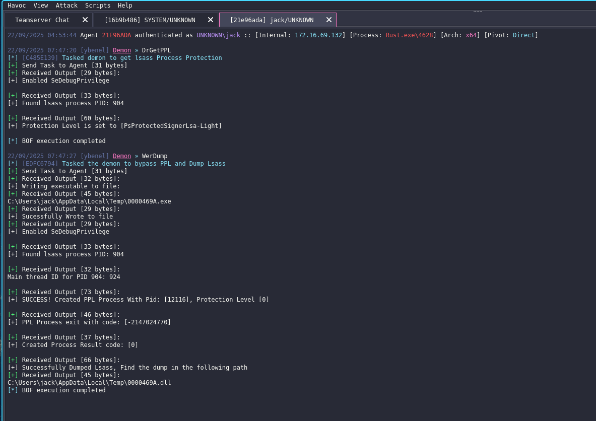

# WerDump
A Beacon Object File BOF for Havoc/CS to dump Process Protected Lsass using WerFaultSecure.

By default this BOF, writes `WerFaultSecure.exe` to the `temp` directory of the user's context with a random filename and saves the dump in the same directory as `.dll`.
This is a POC Bof, It could be extended and modified the way you like and add many improvements like remote dump.
All temporary files gets cleaned up after the dump.

==WARNING== to prevent the system from becoming unresponsive, you must use `WerResume` to resume the `lsass.exe` process from a different beacon (process) before you execute `WerDump`, so make sure to run `WerResume` first then `WerDump` within a second.
`WerDump` beacon process is affected by the Process Protection Policy established by the child process `WerFaultSecure`, which prevents it from opening a handle to lsass.exe. This is why it can't resume lsass.exe on its own.
`WerResume` includes a 5-second delay to give you enough time to execute `WerDump` while lsass.exe is suspended. for increased safety, you can modify the code to extend this delay.

# Credits
Thanks to Two Seven One Three  [TwoSevenOneT - WSASS](https://github.com/TwoSevenOneT/WSASS)

# Author: 
[ybenel](https://github.com/m1ndo)

